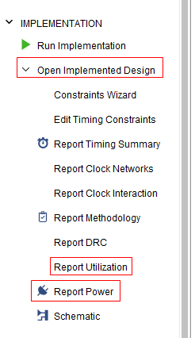
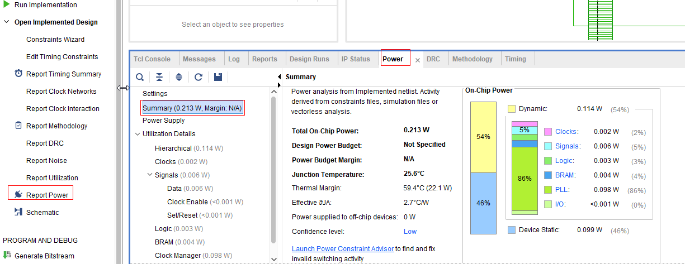

## 1、实验内容提交说明
单周期CPU设计提交：
```angular2
数据通路表、控制信号取值表、工程文件 
```
 

多周期CPU设计提交：
```angular2
数据通路表、控制信号取值表、工程文件
```


实验报告提交：
```angular2
完成单周期CPU设计与实现的同学根据单周期设计的内容完成实验报告。
完成多周期CPU设计与实现的同学根据多周期设计的内容完成实验报告。
```


## 2、实验报告说明

### 2.1、性能分析（资源、功耗、主频）

在implementation下可以查看资源、功耗、时序分析等数据。

<br/>  

资源使用情况指的是FPGA的LUT、Register、Block Mem等硬件资源的使用，点击"Report Utilization"中查看硬件资源消耗情况，sumary是汇总，hierarchy是各个模块资源消耗。
<br/>   

点击"Report Power"查看功耗分析。


主频分析主要是所实现的CPU能跑到最大的时钟频率是多少，FPGA板上的输入时钟是100MHz，指导书上给的是用PLL进行降频为23MHz，也可以跑其他频率，
在PLL IP核中调整提高时钟频率，查看自己完成的CPU频率最高可以到多少。 另外可以在implementation中查看"Report Timming Summary"，根据建立时间、保持时间等数据计算理论上可以达到的频率。


