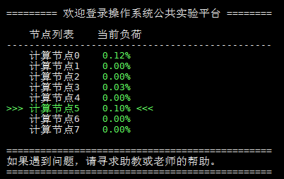
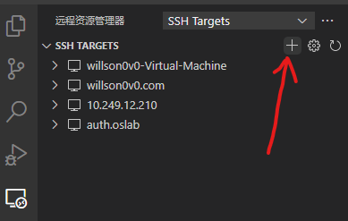
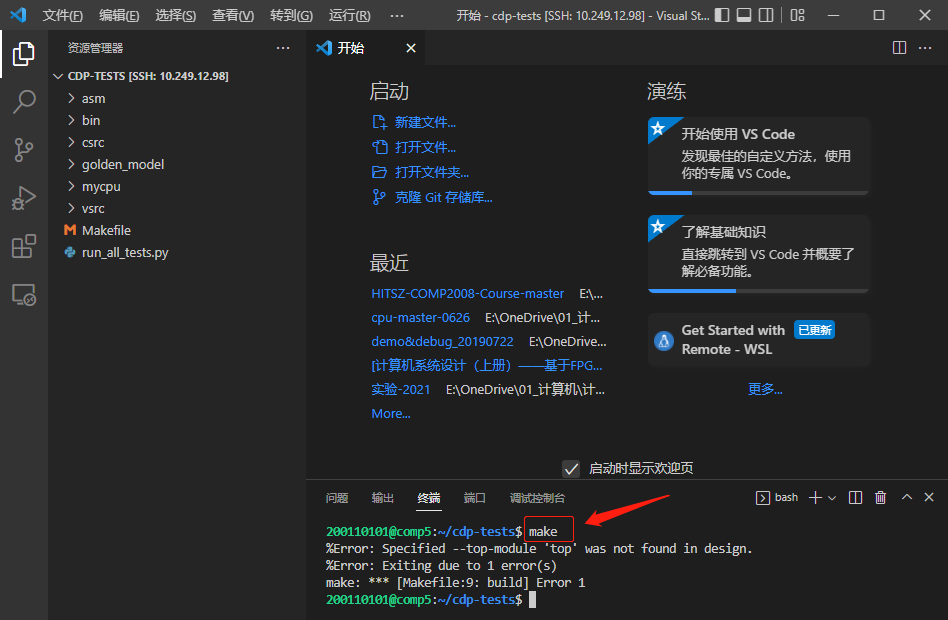
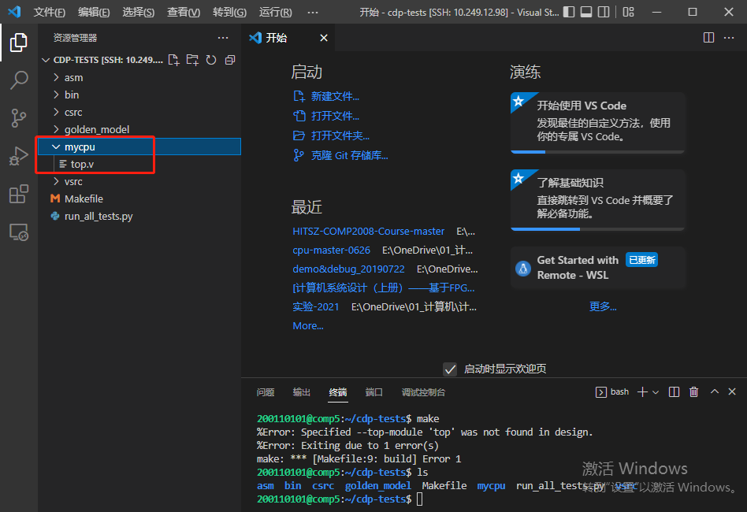
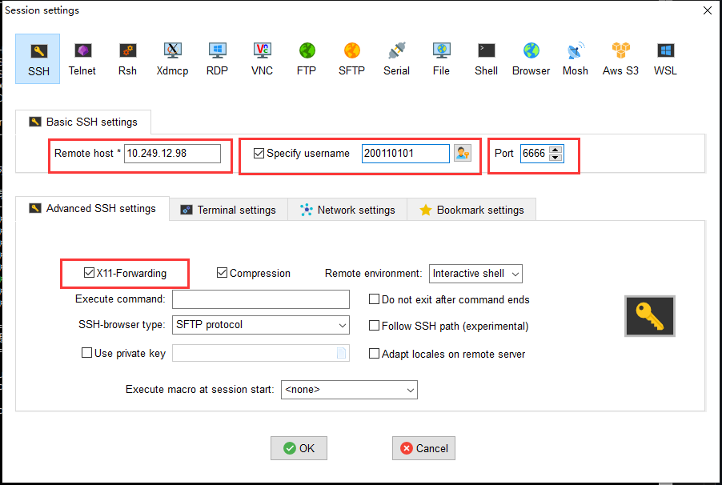
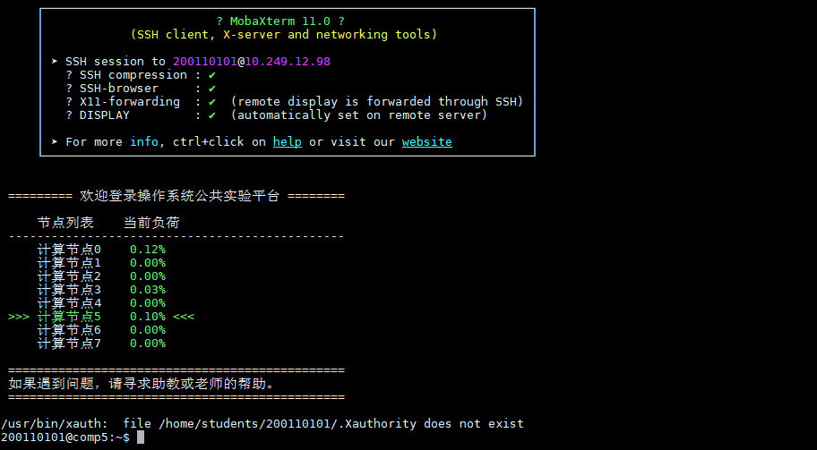
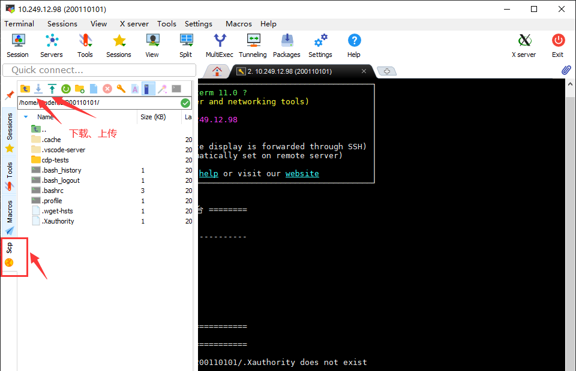
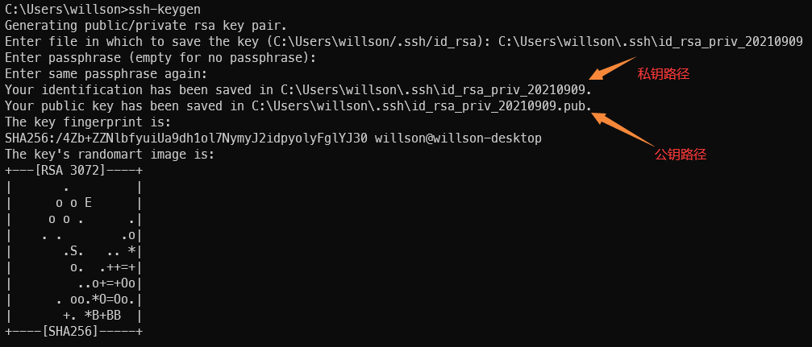

!!! warning 通知
    严禁使用远程实验环境做与教学无关事宜，杜绝使用公共资源挖矿等，一经发现将严肃处理，感谢配合！

## 0. 速查信息

&emsp;&emsp;远程实验平台IP地址： **10.249.12.98** ，端口号： **6666**

!!! info 提示
    用户名和初始密码都是 **你的学号** ，出于安全考虑，建议你初次登录后修改初始密码。

&emsp;&emsp;远程实验平台共有8个计算节点，每一个计算节点都提供相同的服务，可能你每次登录的计算节点会不一样，但无须担心，你看到的文件都是一样的。



## 1. 快速入门

### 1.1 环境准备

&emsp;&emsp;需要配合远程实验平台使用的软件：

- Visual Studio Code
- MobaXterm

### 1.2 Visual Studio Code

#### 1.2.1 如何安装Visual Studio Code？

&emsp;&emsp;打开Visual Studio Code的[官方网站](https://code.visualstudio.com/)，点击中间的“Download for Windows”下载它的安装包。双击运行安装包，并完成安装即可。你可以从开始菜单找到新安装上的Visual Studio Code。

### 1.2.2 将Visual Studio Code连接到实验平台

&emsp;&emsp;Visual Studio Code安装完成后，从开始菜单打开它。我们需要安装Remote - SSH插件。点击VS Code左侧扩展(extension)按钮，在搜索框中键入“remote ssh”，点击Remote - SSH插件，并安装。


&emsp;&emsp;左侧边栏应该会多出一个这样的图标：
点击这个图标，选择SSH TARGETS右侧的`+`号：



&emsp;&emsp;这会在屏幕上方中央弹出输入框，要求输入ssh指令。在这里输入`ssh 你的学号@计算节点IP -p 6666`，例如`ssh 200110101@10.249.11.143 -p 6666`就是学号为200110101的同学链接到远程实验平台，端口号为6666。


&emsp;&emsp;输入完成后，按下回车。如果弹出下图所示的界面，则再次按下回车：


&emsp;&emsp;现在，SSH Target添加成功，左侧SSH Target中应该增加了一栏。将鼠标移上去，点击这一栏右侧的小图标：


&emsp;&emsp;这会打开一个新的VS Code窗口。新打开的窗口会要求你选择目标机器的平台，选择Linux，按下回车：


&emsp;&emsp;如果如下图所示要求你确认是否连接，则再次按下回车：


&emsp;&emsp;接下来，它会要求你输入密码。**初始密码即学号**。


&emsp;&emsp;最后一次按下回车。如果没有更多提示，左下角显示`SSH: 实验平台的IP地址`，说明连接成功。


&emsp;&emsp;现在，点击下方的“终端”按钮，打开终端：


&emsp;&emsp;出于安全考虑，我们首先修改默认密码。点击终端，在其中键入以下内容，并回车：

```bash
passwd
```

&emsp;&emsp;此时，它会要求你输入旧密码。旧密码（即默认密码）为你的学号。完成后回车。随后，它会要求你输入新密码，并进行确认。


### 1.3 下载trace测试包

&emsp;&emsp;接下来，我们将cdp-tests测试源码包复制到自己的工作空间。 在终端中键入以下内容，并回车：

``` bash
cd ~
git clone https://github.com/HITSZ-CDP/cdp-tests.git
```

&emsp;&emsp;你应该会看到这样的输出：

``` bash
Cloning into 'cdp-tests'...
done.
```

&emsp;&emsp;这代表你已经将cdp-tests的副本下载到自己的工作空间了。

&emsp;&emsp;接下来，切换成peri分支：

``` bash
git checkout peri
```

&emsp;&emsp;你可以点击左侧边栏最上面的按钮，并打开文件夹：


&emsp;&emsp;在弹出的菜单中，选择cdp-tests，并按下“确认”：


&emsp;&emsp;再次输入密码，按下回车确认，并信任作者。


&emsp;&emsp;你初步完成了对工作区的设置。接下来，我们可以测试cdp-tests能否编译。 如果下方未显示终端，点击上方菜单“查看”-“终端”，或者按下Ctrl-`（注意：`不是‘（单引号），是键盘左上角的那个按键。）以打开终端界面。在新弹出的终端中，输入下面的命令：



&emsp;&emsp;此时，提示top模块有错误，这时你就可以在mycpu目录下添加你自己的CPU代码了，详见[测试框架](trace.md#1-了解测试框架)说明。



### 1.3 使用MobaXterm

### 1.3.1 SSH登录 

&emsp;&emsp;MobaXterm 是一款远程控制工具，支持创建SSH、Telnet、Rsh、Xdmc、RDP、VNC、FTP、 SFTP、串口(Serial COM)、本地Shell、Mosh、Aws、WSL(微软子系统)等超多连接功能。MobaXterm 提供了人性化的操作界面，支持与主流的操作系统连接进行控制和管理操作，功能十分强大。

&emsp;&emsp;打开MobaXterm，单击打开工具Session（位于左上角）选择New sessions打开新建窗口，选择SSH，输入远程服务器的IP地址、登陆用户名及端口（ **端口号：6666** ），点击OK。


&emsp;&emsp;在弹出的对话框中，选择SSH


&emsp;&emsp;SSH配置信息如下：



&emsp;&emsp;输入密码：


&emsp;&emsp;进入终端。



### 1.3.2 ftp文件传输

&emsp;&emsp;SSH远程登录完毕，双击左下角的Sftp，就出现了远程服务器的文件目录。



&emsp;&emsp;接下来在可以点击按钮“Upload to current folder”或者“Download selected files”，在windows系统和远程实验平台之间上传或下载文件。

## 3. 一些进阶指引

### 3.1 使用ssh密钥快捷认证

&emsp;&emsp;有没有感觉每次都要输入密码非常麻烦？ssh密钥可以让认证流程自动化，大大解放双手。在 **本地** windows下，以管理员身份打开CMD，输入

```bat
ssh-keygen
```

&emsp;&emsp;跟随指引，一路回车，便可完成ssh密钥的生成。**请务必保存好自己的私钥，不要泄露！**



&emsp;&emsp;接下来，我们将私钥加入到自己的身份认证中。在终端继续输入：

```bat
ssh-add 你的私钥的完整路径
# 例如，如上图所示，我应该键入ssh-add C:\Users\willson\.ssh\id_rsa_priv_20210909
```

&emsp;&emsp;在你的Windows上将公钥文件打开（用你喜欢的纯文本编辑器，比如记事本或者VS Code），复制其中的内容。

&emsp;&emsp;最后，登录你想要快捷认证的计算节点的终端，并执行下面的命令：

```bash
mkdir -p ~/.ssh
vi ~/.ssh/authorized_keys
```

&emsp;&emsp;这会打开一个文件编辑界面。按下`i`按键，进入编辑模式，并粘贴到上面节点终端中编辑界面的一个新行里。按下`Esc`，按下`:wq`可保存并退出。如果不放心，可以`cat ~/.ssh/authorized_keys`并检查输出和你刚才贴进去的是不是一样的。
配置完成后，下次你从Windows登陆时，应该就无需密码认证了。

### 3.2 Visual Studio Code：进阶使用

&emsp;&emsp;有没有怀念Visual Studio、CodeBlock等IDE中便捷的一键运行功能？没关系，完备的插件市场配合自动化脚本可以完成你的一切功能需求！
*下略：感兴趣的话可以了解一下Intelli Sense、MakeFile以及VSCode中的Task。*

### 3.3 Q&A

#### 我不是Windows 10系统，这会带来什么问题吗？

##### 我在使用Linux/macOS？

&emsp;&emsp;Visual Studio Code也有Linux版和macOS版，具体操作大同小异，毕竟环境主要在服务器上。

##### 我正在使用旧的Windows版本/我没有更新我的Windows 10系统？

&emsp;&emsp;请更新你的系统。使用过时的系统有各种各样的风险，其中最大的是与时代脱轨。

##### 我正在使用Windows 11？

&emsp;&emsp;这篇教程完全兼容Windows 11。笔者正在用的就是Windows 11。

#### 我输入的所有命令看起来都是对的，但是为什么运行失败了？

##### 全角标点符号/英文字符？

&emsp;&emsp;确保你输入的是正常的半角英文字符与英文标点符号，如图所示：


&emsp;&emsp;这可以通过一起按下shift+空格，或者切换到英文输入法解决。**永远不要在中文输入法下输入命令！**


