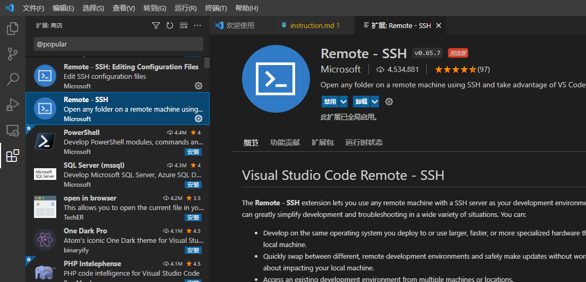
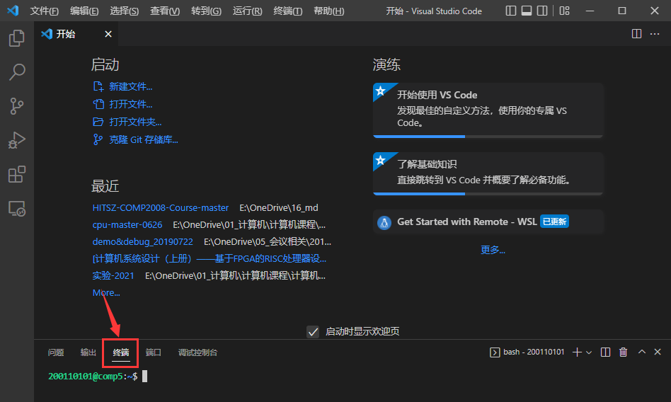
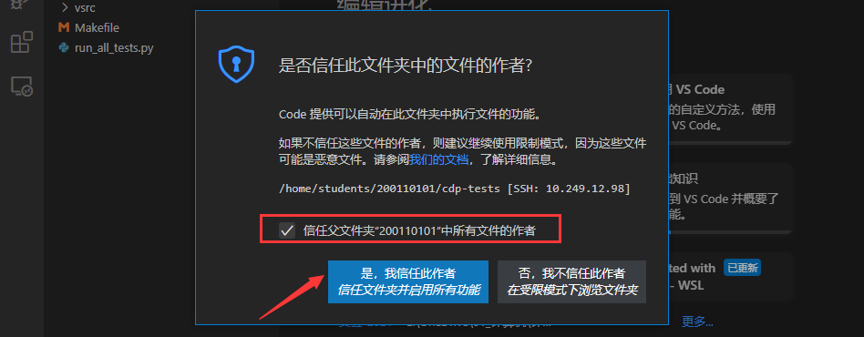

!!! warning 通知
    &emsp;&emsp;严禁使用远程实验环境做与教学无关事宜，杜绝使用公共资源挖矿等，一经发现将严肃处理，感谢配合！

## 1. 速查信息

&emsp;&emsp;远程实验平台IP地址： **10.249.12.98** ，端口号： **6666**

!!! info 提示
    &emsp;&emsp;用户名和初始密码都是 **你的学号** ，出于安全考虑，建议你初次登录后修改初始密码。

&emsp;&emsp;远程实验平台共有8个计算节点，每一个计算节点都提供相同的服务，可能你每次登录的计算节点会不一样，但无须担心，你看到的文件都是一样的。

<center></center>

## 2. 快速入门

### 2.1 环境准备

&emsp;&emsp;需要配合远程实验平台使用的软件：

- Visual Studio Code
- MobaXterm

### 2.2 使用VS Code

#### 2.2.1 安装VS Code

&emsp;&emsp;打开<a href="https://code.visualstudio.com/" target="_blank">VS Code官网</a>，点击`Download for Windows`按钮下载安装包，然后双击安装包完成安装。你可以从开始菜单找到新安装上的VS  Code。

#### 2.2.2 将VS Code连接到实验平台

&emsp;&emsp;打开VS Code，点击左侧的扩展(extension)按钮，在搜索框中键入`remote ssh`，点击`Remote - SSH`插件并安装，如下图所示。



&emsp;&emsp;左侧边栏将出现此图标：。点击这个图标，选择`SSH TARGETS`右侧的`+`号，如下图所示。

<center></center>

&emsp;&emsp;这会在屏幕上方中央弹出输入框，要求输入ssh指令。在这里输入`ssh 你的学号@计算节点IP -p 6666`，例如`ssh 200110101@10.249.11.143 -p 6666`就是学号为200110101的同学链接到远程实验平台，端口号为6666。


&emsp;&emsp;输入完成后，按下回车。如果弹出下图所示的界面，则再次按下回车：


&emsp;&emsp;现在，SSH Target添加成功，左侧SSH Target中应该增加了一栏。将鼠标移上去，点击这一栏右侧的小图标：

<center></center>

&emsp;&emsp;这会打开一个新的VS Code窗口。新打开的窗口会要求你选择目标机器的平台，选择Linux，按下回车：


&emsp;&emsp;如果如下图所示要求你确认是否连接，则再次按下回车：


&emsp;&emsp;接下来，它会要求你输入密码。**初始密码即学号**。


&emsp;&emsp;最后一次按下回车。如果没有更多提示，左下角显示`SSH: 实验平台的IP地址`，说明连接成功。


&emsp;&emsp;现在，点击下方的“终端”按钮，打开终端：



&emsp;&emsp;出于安全考虑，我们首先修改默认密码。点击打开终端，键入`passwd`并回车。

&emsp;&emsp;此时，它会要求你输入旧密码。旧密码（即默认密码）为你的学号。完成后回车。随后，它会要求你输入新密码，并进行确认。

<center></center>

!!! warning "注意事项 :loudspeaker:"
    &emsp;&emsp;如果VSCode出现`bad owner or permission`报错，解决方法可参考《<a href="https://cloud.tencent.com/developer/article/1643437" target="_blank">Win10下Bad owner or permissions on .ssh/config的解决办法-腾讯云</a>》。

### 2.3 下载trace测试包

&emsp;&emsp;接下来，我们将cdp-tests测试源码包复制到自己的工作空间。

&emsp;&emsp;在终端中键入以下内容，并回车：

``` bash
 1|cd ~
 2|git clone https://github.com/HITSZ-CDP/cdp-tests.git
```

&emsp;&emsp;你应该会看到这样的输出：

``` bash
 1|Cloning into 'cdp-tests'...
 2|done.
```

&emsp;&emsp;这代表你已经将cdp-tests的副本下载到自己的工作空间了。

&emsp;&emsp;接下来，输入`git checkout peri`命令，切换到peri分支：

&emsp;&emsp;你可以点击左侧边栏最上面的按钮，并打开文件夹：


&emsp;&emsp;在弹出的菜单中，选择cdp-tests，并按下“确认”：


&emsp;&emsp;再次输入密码，按下回车确认，并信任作者。



&emsp;&emsp;你初步完成了对工作区的设置。接下来，我们可以测试cdp-tests能否编译。 如果下方未显示终端，点击菜单栏的`查看`->`终端`，或使用快捷键`Ctrl`+``` （注意：不是单引号，而是键盘左上角的那个按键）打开终端界面。

&emsp;&emsp;在新弹出的终端中，输入`make`命令，如下图所示。


&emsp;&emsp;此时，提示top模块有错误，这时你就可以在mycpu目录下添加你自己的CPU代码了，详见<a href="../trace.md#1-了解测试框架" target="_blank">测试框架</a>说明。


### 2.4 使用MobaXterm

#### 2.4.1 SSH登录 

&emsp;&emsp;MobaXterm 是一款远程控制工具，支持创建SSH、Telnet、Rsh、Xdmc、RDP、VNC、FTP、 SFTP、串口(Serial COM)、本地Shell、Mosh、Aws、WSL(微软子系统)等超多连接功能。MobaXterm 提供了人性化的操作界面，支持与主流的操作系统连接进行控制和管理操作，功能十分强大。

&emsp;&emsp;打开MobaXterm，单击打开位于左上角的工具`Session`，选择`New sessions`打开新建窗口，选择`SSH`，输入远程服务器的IP地址、登陆用户名及端口（ **端口号：6666** ），点击OK。

<center></center>

&emsp;&emsp;在弹出的对话框中，选择SSH。


&emsp;&emsp;SSH配置信息如下：


&emsp;&emsp;输入密码：


&emsp;&emsp;进入终端。


#### 2.4.2 FTP文件传输

&emsp;&emsp;SSH远程登录完毕，双击左下角的`Sftp`，就出现了远程服务器的文件目录。


&emsp;&emsp;接下来在可以点击按钮`Upload to current folder`或者`Download selected files`，在Windows系统和远程实验平台之间上传或下载文件。

!!! warning "注意事项 :loudspeaker:"
    &emsp;&emsp;使用完毕后，需在MobaXterm中输入`exit`命令退出！

## 3. 一些进阶指引

### 3.1 使用ssh密钥快捷认证

&emsp;&emsp;有没有感觉每次都要输入密码非常麻烦？ssh密钥可以让认证流程自动化，大大解放双手。在 **本地** Windows下，以管理员身份打开CMD，输入`ssh-keygen`。

&emsp;&emsp;跟随指引，一路回车，便可完成ssh密钥的生成。**请务必保存好自己的私钥，不要泄露！**


&emsp;&emsp;接下来，我们将私钥加入到自己的身份认证中。在终端继续输入：

```bash
 1|ssh-add 你的私钥的完整路径
 2|# 例如，如上图所示，我应该键入ssh-add C:\Users\willson\.ssh\id_rsa_priv_20210909
```

&emsp;&emsp;在你的Windows上将公钥文件打开（用你喜欢的纯文本编辑器，比如记事本或者VS Code），复制其中的内容。

&emsp;&emsp;最后，登录你想要快捷认证的计算节点的终端，并执行下面的命令：

```bash
 1|mkdir -p ~/.ssh
 2|vi ~/.ssh/authorized_keys
```

&emsp;&emsp;这会打开一个文件编辑界面。按下`i`按键，进入编辑模式，并粘贴到上面节点终端中编辑界面的一个新行里。按下`Esc`，按下`:wq`可保存并退出。如果不放心，可以`cat ~/.ssh/authorized_keys`并检查输出和你刚才贴进去的是不是一样的。
配置完成后，下次你从Windows登陆时，应该就无需密码认证了。

### 3.2 VS Code：进阶使用

&emsp;&emsp;有没有怀念VS Code、CodeBlock等IDE中便捷的一键运行功能？没关系，完备的插件市场配合自动化脚本可以完成你的一切功能需求！
*下略。感兴趣的话可以了解一下Intelli Sense、MakeFile以及VSCode中的Task。*

## 4. Q&A

### 4.1 我不是Windows 10系统，这会带来什么问题吗？

#### 4.1.1 我在使用Linux/macOS？

&emsp;&emsp;Visual Studio Code也有Linux版和macOS版，具体操作大同小异，毕竟环境主要在服务器上。

#### 4.1.2 我正在使用旧的Windows版本/我没有更新我的Windows 10系统？

&emsp;&emsp;请更新你的系统。使用过时的系统有各种各样的风险，其中最大的是与时代脱轨。

#### 4.1.3 我正在使用Windows 11？

&emsp;&emsp;此教程完全兼容Windows 11。

### 4.2 我输入的所有命令看起来都是对的，但是为什么运行失败了？

&emsp;&emsp;确保你输入的是正常的半角英文字符与英文标点符号，如图所示：

<center></center>

&emsp;&emsp;这可以通过一起按下shift+空格，或者切换到英文输入法解决。

&emsp;&emsp;**永远不要在中文输入法下输入命令！**
